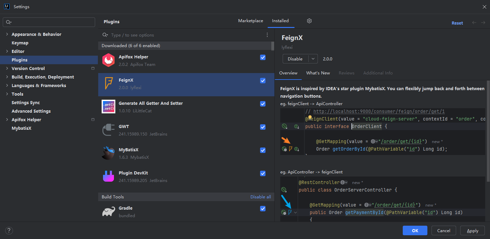
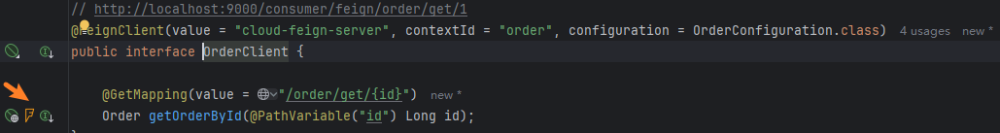
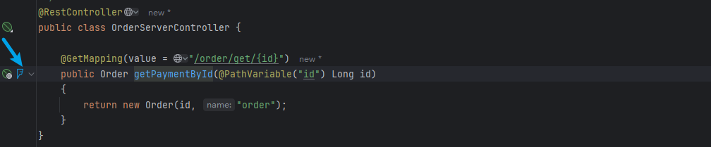

  
  <h2>FeignX</h2>

已上架idea插件市场：https://plugins.jetbrains.com , 搜索FeignX

 
FeignX is inspired by IDEA's star plugin MybatisX. 

You can flexibly jump back and forth between FeignClient and remote service ApiController through method-level navigation buttons.

eg. feignClient -> ApiController

  

eg. ApiController -> feignClient

  

So, install the FeignX plugin as soon as possible!.</b>

