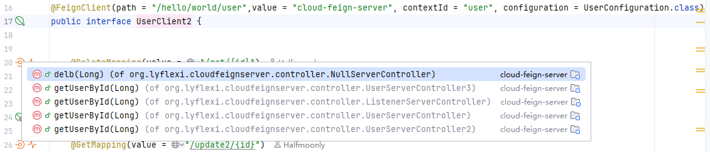
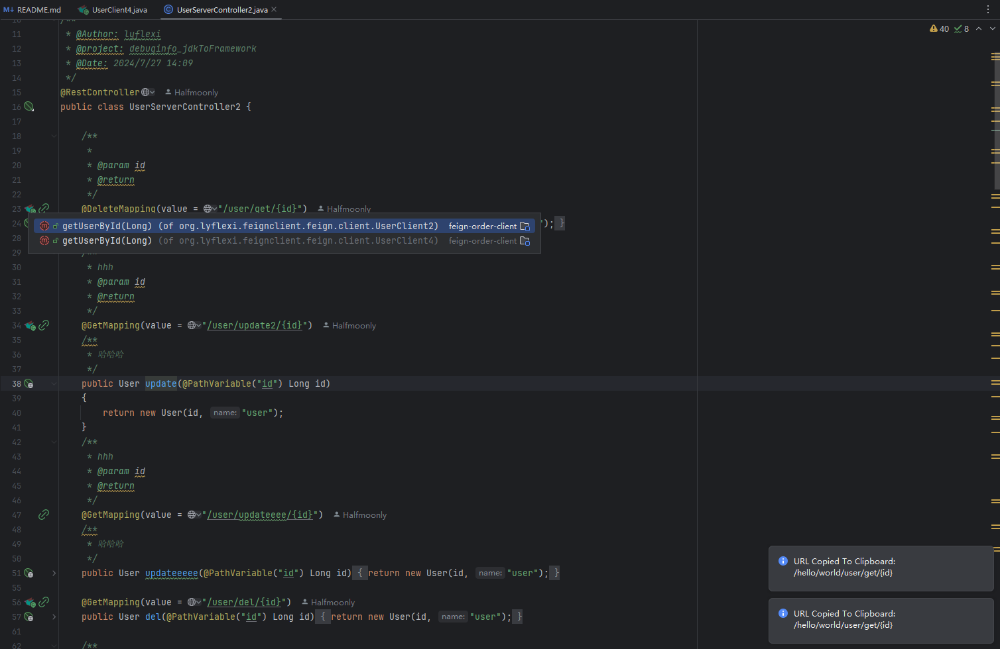
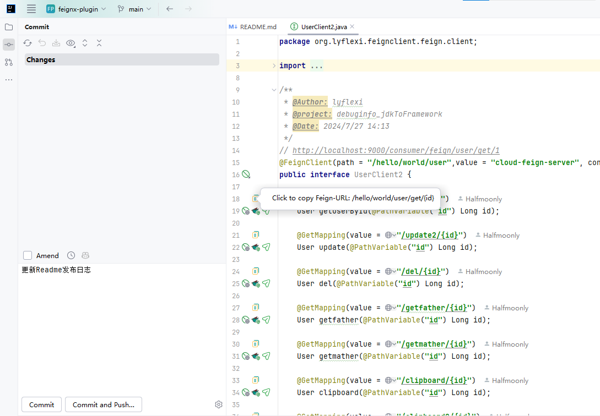
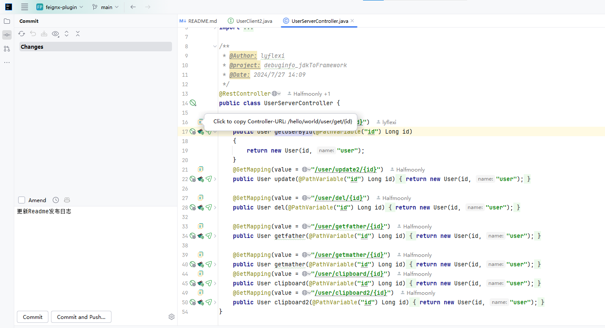
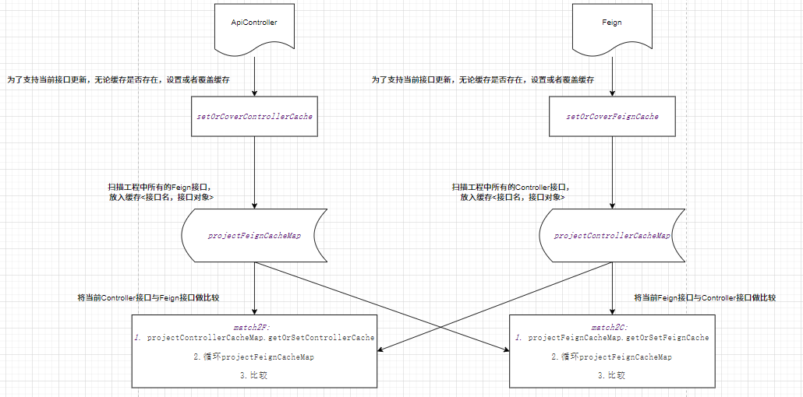
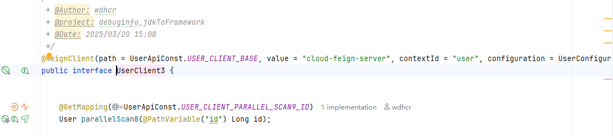
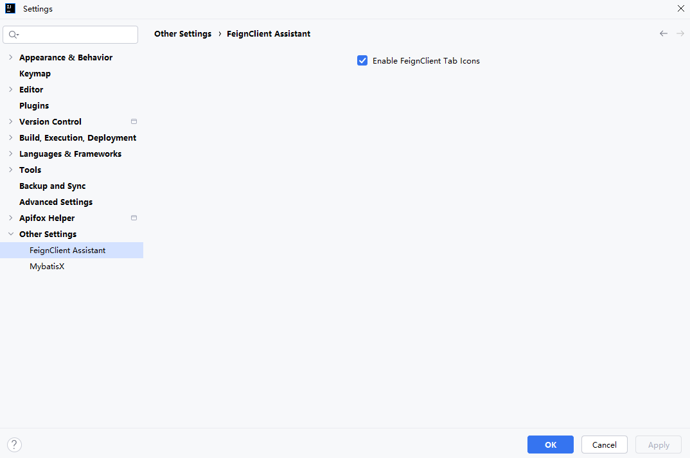

<div align="center">
  
  <h2>FeignClient Assistant</h2>
</div>

## 贡献者名单

<a href="https://github.com/Halfmoonly/feignx-plugin/graphs/contributors">
  
</a>

## 我们更名啦，FeignClient Assistant

曾用名：[FeignX]/[Navigator4URL OpenFeign RestController]

已上架IntelliJ IDEA插件市场：https://plugins.jetbrains.com/plugin/25604-navigator4url-openfeign-restcontroller
- 2025/03/12 官方市场用户下载量突破5000
- 2025/03/20 官方市场用户下载量突破6000
- 2025/03/26 官方市场用户下载量突破7000
- 

求star⭐⭐
## 使用教程
IntelliJ IDEA内Settings->plugins->Marketplace->搜索FeignClient Assistant下载安装

---
<div align="center">
  
  <p>Marketplace</p>
</div>


<p>FeignClient Assistant(FeignX) is a Free SpringCloud Assistant. Author 刘岩</p>

FeignX is inspired by IDEA's star plugin MybatisX.

1. You can flexibly jump back and forth between FeignClient and remote service ApiController cross-module,through method-level navigation gutter `bird`.

2. FeignClient Assistant supports configuration file parsing，such as yml/yaml/properties of

   - server.servlet.context-path 

   - spring.mvc.servlet.path
   
3. FeignClient Assistant is sufficiently accurate with options, after many rounds of optimization.

4. FeignClient Assistant is sufficiently high-performance with Bilateral cache, after many rounds of optimization.

5. FeignClient Assistant supports url full path copying to the clipboard (both Feign and Controller interfaces), In order to help the Vim friends.

eg. FeignClient 方法导航跳转至 ApiController，与URL全路径一键剪切板拷贝

<div align="left">
  
</div>

eg. ApiController  方法导航跳转至 FeignClient，与URL全路径一键剪切板拷贝

<div align="left">
  
</div>

## 更新日志
### 🚀FeignClient Assistant:v1.0.0
- 跨模块实现FeignClient导航ApiController功能：FeignClient-ApiController Mutually Navigation
- 跨模块实现ApiController导航FeignClient功能：ApiController-FeignClient Mutually Navigation

### 🚀FeignClient Assistant:v2.1.0
适配最新版本的IntelliJ IDEA

### 🐞FeignClient Assistant:v3.0.0
[fix] 重大bug修复，修复了由于缓存导致的目标接口动态监测失效的问题

### 🚀FeignClient Assistant:v4.0.0
[feat] 重大功能更新，server端适配了springboot配置文件application.properties/application.yml/application.yaml的解析机制：

支持以下配置的解析
1. tomcat配置属性：server.servlet.context-path
2. springmvc配置属性：spring.mvc.servlet.path


在 Spring Boot 出现之前，Dispatcher Servlet 是在 web.xml 文件中声明的，如下图
```xml
<web-app>
   <servlet>
         <servlet-name>example</servlet-name> 
        <servlet class> 
             org.springframework.web.servlet.DispatcherServlet 
        </servlet-class> 
        <load-on-startup>1</load -on-startup> 
    </servlet>
   <servlet-mapping>
        <servlet-name>test</servlet-name> 
        <url-pattern>*.test</url-pattern> 
   </servlet-mapping>
 </web-app>
```

这个DispatcherServlet是实际的Servlet，它继承自基类HttpServlet。

在 Spring Boot 出现之后，spring-boot-starter-web starter 自动装配机制将DispatcherServlet默认配置为 URL 模式“/”。

但是，如果需要，我们可以使用自定义 URL 模式。application.properties文件中如下
```properties
server.servlet.context-path=/hello
spring.mvc.servlet.path=/world
```

通过上面的配置，DispatcherServlet被配置为处理 URL 模式/world，并且springboot根上下文路径将是/hello。因此，DispatcherServlet监听http://ip/port/hello/world，，as prefix path by @FeignClient，the sample is below
```java
@FeignClient(path = "/hello/world",value = "cloud-feign-server", contextId = "user", configuration = UserConfiguration.class)
public interface UserClient {

    @GetMapping(value = "/user/get/{id}")
    User getUserById(@PathVariable("id") Long id);
}
```


yml/yaml配置同上。

### 🚀FeignClient Assistant:v4.1.1
此版本feignx重绘了gutter


同时适配了最新版IDEA的Light主题，欢迎在IDEA内在线更新至4.1.1版本（三天后上线），或者提前安装离线版体验！
https://github.com/lyflexi/feignx-plugin/releases/tag/v4.1.1

修复了issues:https://github.com/Halfmoonly/feignx-plugin/issues/3


感谢官方工作人员的指引：Natalia Melnikova (JetBrains Marketplace) marketplace@jetbrains.com

感谢社区的帮助与提示：https://intellij-support.jetbrains.com/hc/en-us/community/posts/22814305825042-Why-don-t-pluginIcon-svg-appear-in-Light-theme?page=1#community_comment_22848980293394

感谢@yann Cebron：https://intellij-support.jetbrains.com/hc/en-us/profiles/1283051161-Yann-Cebron

开发社区：https://intellij-support.jetbrains.com/hc/en-us/community/topics/200366979-IntelliJ-IDEA-Open-API-and-Plugin-Development

### 🚀FeignClient Assistant:v4.1.3
thanks my friend's pr : https://github.com/Halfmoonly/feignx-plugin/pull/9
1. Adapted bootstrap.properties/bootstrap.yml/bootstrap.yaml
2. Adapted many writtings of path，as @FeignClient(path = "/sys") and @FeignClient(path = "sys") and @FeignClient(path = "sys/")


### 🚀FeignClient Assistant:v4.1.5
极少数分布式场景下的nacos需要以下配置，往往会配置在本地的bootstrap.yml/yaml中，而非application.yml/yaml中

1. server.servlet.context-path = /hello
2. spring.mvc.servlet.path = /world

此版本修复了FeignX读取本地bootstrap.yml/yaml中上述配置失效的问题

### 🐞FeignClient Assistant:v4.1.6
FeignX 4.1.5 is binary incompatible with IntelliJ IDEA Ultimate IU-193.7288.26 due to the following problem Method not found . This can lead to NoSuchMethodError exception at runtime.

Feignx:v4.1.6 resolve IntelliJ IDEA Ultimate 2019.3.51 compatibility problem.

- remove 1 usage of deprecated API (V1.381)
- Invocation of unresolved method PsiEditorUtil.findEditor(PsiElement)
- Method SearchControllerAction.navigateToControllerCode(...) contains an invokestatic instruction referencing an unresolved method PsiEditorUtil.findEditor(PsiElement).

--- 
### 🚀 FeignClient Assistant:v4.1.8
v4.1.8发布——对应分支main-fix-cachev2

reslove issue #10：https://github.com/Halfmoonly/feignx-plugin/issues/10

        1. 我们更名啦，由FeignX更名为FeignClient Assistant
        2. 极致提升性能，引入CacheManager，管理双边缓存FeignInterface和ApiController
        3. 欢迎Star：https://github.com/Halfmoonly/feignx-plugin

[feignx-4.1.8.zip](https://github.com/user-attachments/files/19140074/feignx-4.1.8.zip)


### 🐞 FeignClient Assistant:v4.1.9
v4.1.9发布——对应分支main-fix-cachev3

我们优化了双边缓存更新策略（Optimize cache update policies）

https://github.com/user-attachments/files/19148594/OpenFeign.Assistant-4.1.9.zip


### 🚀 FeignClient Assistant V5.1.0 更新内容
reslove issue #6：https://github.com/Halfmoonly/feignx-plugin/issues/6


1. 我们又更名啦[笑哭]，由FeignX更名为FeignClient Assistant
2. 为了方便Vim党，我们支持了url完整路径复制至剪切板（Feign接口和Controller接口均支持）
3. 欢迎Star：https://github.com/Halfmoonly/feignx-plugin

CopyFeignUrlLineMarkerProvider：



CopyControllerUrlLineMarkerProvider：



朋友们记得先将zip解压出jar包，再离线安装jar包哟~~：https://github.com/user-attachments/files/19149196/Navigator4URL.OpenFeign.RestController-5.1.0.zip

### 🐞 FeignClient Assistant V5.1.1 更新内容
修复分支：hotfix/main-copy-notify

1. 我们修复了一键复制URL功能的消息通知失败的问题，以及偶先空指针的现象

2. 我们优化了Copy-Gutter和Bird-Gutter的展现位置，将其从方法签名处移至RequestMapping等Rest注解处，这样更加符合直觉

3. 我们优化了Copy-Gutter和Bird-Gutter的动态解析，使用户后期在修改方法签名的时候（如添加/**/注释或者添加自定义业务注解的时候），Gutter的位置随着RequestMapping等Rest注解的位置动态生效

4. 我们优化了一键复制URL功能的Copy-Gutter图标设计，更加的优雅


### 🐞 FeignClient Assistant V5.1.2 更新内容

1. 我们修复了https://github.com/Halfmoonly/feignx-plugin/issues/11，这曾经是个已经被修复但忘记合并至主分支的修复分支：hotfix/main-fix-bootstrap，见：https://github.com/Halfmoonly/feignx-plugin/issues/8


### 🐞 FeignClient Assistant V5.2.0 更新内容
本次对应修复/缓存优化/多线程优化/API优化的分支：main-fix-cachev4

1. 我们优化了双边缓存的更新机制，同时重构了缓存框架，大大提升了插件性能
2. 我们优化了用户打注释/***/的时候，由于psiMethod丢失，可能导致的空指针异常
3. 我们使用了IntelliJ的类快速索引缓存系统PsiShortNamesCache，狠狠加速了原来的手写磁盘递归扫描Class（allJavaFileClass）
4. 我们使用了Java线程池，加速了初始化过程中，构建出全量接口方法对象HttpMappingInfos的速度（ApiControllers和FeignClients）
5. 我们使用了IntelliJ的带缓存的注解判断方法psiMethod.hasAnnotation，加速了类型判断（ApiController和FeignClient）

重构的双边缓存架构：



有匪君子，如切如磋，如琢如磨--2025/03/15 凌晨两点

### 🚀 FeignClient Assistant V5.2.1 更新内容
对应分支：feat/main-parallel

默认IO密集型程序核心线程数为`2*N`，并自定义了线程池，优化初始化过程中，构建出全量接口方法对象HttpMappingInfos的速度（ApiControllers和FeignClients）

### 🚀 FeignClient Assistant V5.3.0 更新内容
对应分支：feat/main-cache

我们额外自定义了项目初始化PsiClass缓存管理器InitialPsiClassCacheManager，将原先的两次全盘allJavaFileClass扫描降低为1次，狠狠加速了原来手写的磁盘递归扫描

### 🐞 FeignClient Assistant V5.3.1 更新内容
对应分支：main-fix-dead

1. 修复了偶发的卡死现象

### 🐞 FeignClient Assistant V5.3.2 更新内容
对应分支：main-fix-dead2

1. 修复了偶发的卡死现象

### 🐞🚀 FeignClient Assistant V5.4.0 更新内容
对应分支：hotfix/main-dead

1. feat: 合并了来自开发者的一个特性PR：https://github.com/Halfmoonly/feignx-plugin/pull/14 ,支持Restful注解path中的变量或者静态常量的解析（FeignClient和ApiController），感谢@wdhcr



2. fix: 重大bug修复，彻底修复了打开多个IDEA项目时候偶发的卡死现象，我们定位到是线程池的问题并做出了修复与避免。希望反馈的朋友们耐心等待此版本上架

### 🚀 FeignClient Assistant v5.5.0更新内容
对应分支feat/main-tab-svg

1. 我们上线了FeignClient和RestController类文件的图标替换功能，默认开启，用户可以在IDEA设置面板中关闭，修改配置后记得重启IDEA。
2. 你将体验到全新的UI设计风格，包括URL路径一键复制，希望大家喜欢(❤ ω ❤)



### 🐞 FeignClient Assistant v5.5.1版本修复如下异常

修复分支：hotfix/main-fix-tabsvg

定位到是由于v5.5.0中上线的类文件的图标替换功能导致 PSI 元素失效，影响了原先正常的主流程解析逻辑

1. 文件被修改（例如用户编辑代码）。
2. PSI 元素的访问必须在 读操作（Read Action） 或 事件分发线程（EDT） 中进行。
3. 如果在后台线程（非 EDT）直接访问 PSI 元素，可能导致元素失效。
4. 未检查元素有效性等
```
com.intellij.psi.PsiInvalidElementAccessException: Element: class com.intellij.psi.impl.source.PsiClassImpl #JAVA 
invalidated at: see attachment
    at com.intellij.psi.impl.source.SubstrateRef$1.getNode(SubstrateRef.java:43)
    at com.intellij.extapi.psi.StubBasedPsiElementBase.getNode(StubBasedPsiElementBase.java:133)
    at com.intellij.psi.impl.source.PsiClassImpl.getNode(PsiClassImpl.java:102)
    at com.intellij.psi.impl.source.PsiClassImpl.getNode(PsiClassImpl.java:36)
    at com.intellij.extapi.psi.StubBasedPsiElementBase.getStubOrPsiChild(StubBasedPsiElementBase.java:36
    at com.intellij.extapi.psi.StubBasedPsiElementBase.getRequiredStubOrPsiChild(StubBasedPsiElementBase.java:375)
    at com.intellij.psi.impl.source.PsiClassImpl.getModifierList(PsiClassImpl.java:170)
    at com.intellij.psi.PsiJvmConversionHelper.hasListAnnotation(PsiJvmConversionHelper.java:57)
    at com.intellij.psi.PsiModifierListOwner.hasAnnotation(PsiModifierListOwner.java:45)
    at com.intellij.psi.PsiJvmModifiersOwner.hasAnnotation(PsiJvmModifiersOwner.java:32)
    at com.lyflexi.feignx.utils.AnnotationParserUtils.isFeignInterface(AnnotationParserUtils.java:101)
    at com.lyflexi.feignx.utils.FeignClassScanUtils.feignsOfPsiClass(FeignClassScanUtils.java:123)
    at com.lyflexi.feignx.utils.FeignClassScanUtils.scanFeignInterfaces(FeignClassScanUtils.java:107)
    at com.lyflexi.feignx.provider.C2FLineMarkerProvider.collectNavigationMarkers(Controller2FeignLineMarkerProvider.java:43)
...
```
### 🐞 FeignClient Assistant v5.5.2版本修复如下异常

修复分支：hotfix/main-fix-tabsvg2

1. 修复了回车键可能导致的方法旁gutter失效的问题

### 🐞 FeignClient Assistant v5.5.3更新内容
修复分支：main

1. 修复了二次打开项目的时候,有gutter,但无法跳转的问题

---

我们欢迎各位的宝贵意见(^^ゞ)

**诚邀广大开发者大佬们的Pull Request，让我们一起完善FeignClient Assistant(FeignX)插件**

最新版本插件请及时关注IntelliJ IDEA插件市场更新FeignClient Assistant

https://plugins.jetbrains.com/plugin/25604-navigator4url-openfeign-restcontroller

IDEA内插件市场一键安装最方便哟~~
