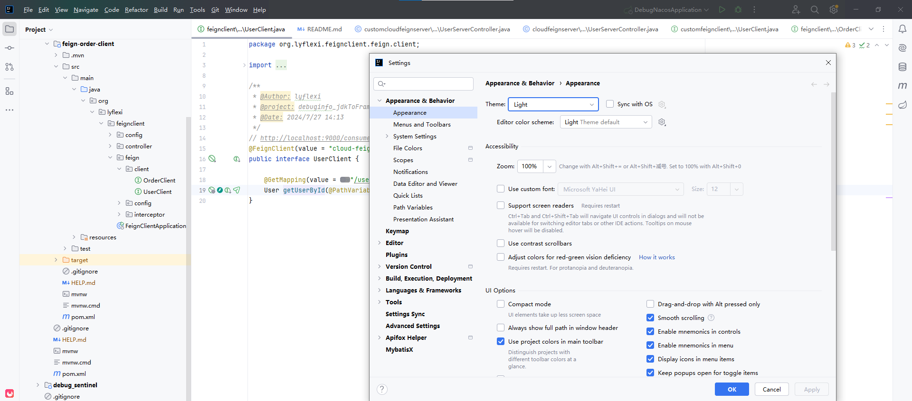

<div align="center">
  
  <h2>FeignX</h2>
</div>

已上架idea插件市场：https://plugins.jetbrains.com , 搜索FeignX下载安装

---
<div align="center">
  
  <p>Marketplace</p>
</div>


FeignX is inspired by IDEA's star plugin MybatisX. 

The FeignX plugin monitors all FeignClient and ApiController in the project based on real-time scanning mechanism, and provides method-level navigation jump capability. 

In short, You can flexibly jump back and forth between FeignClient and remote service ApiController through method-level navigation buttons.

eg. feignClient -> ApiController
<div align="left">
  
</div>

eg. ApiController -> feignClient
<div align="left">
  
</div>


觉得好用，点个star⭐

### Feignx:v1.0.0
cross-module：FeignClient-ApiController Mutually Navigation

cross-module：ApiController-FeignClient Mutually Navigation

### Feignx:v2.1.0
Adapted To Latest IDEA

### Feignx:v3.0.0

[fix]🐞 Major version fix , fix the bug that cannot dynamically detect new interfaces due to cache

### Feignx:v3.1.0
Design a unique logo

### Feignx:v4.0.0
adapted properties/yml/yaml of 1.server.servlet.context-path and 2.spring.mvc.servlet.path


在 Spring Boot 出现之前，Dispatcher Servlet 是在 web.xml 文件中声明的，如下图
```xml
<web-app>
   <servlet>
         <servlet-name>example</servlet-name> 
        <servlet class> 
             org.springframework.web.servlet.DispatcherServlet 
        </servlet-class> 
        <load-on-startup>1</load -on-startup> 
    </servlet>
   <servlet-mapping>
        <servlet-name>test</servlet-name> 
        <url-pattern>*.test</url-pattern> 
   </servlet-mapping>
 </web-app>
```

这个DispatcherServlet是实际的Servlet，它继承自基类HttpServlet。

在 Spring Boot 出现之后，spring-boot-starter-web starter 自动装配机制将DispatcherServlet默认配置为 URL 模式“/”。

但是，如果需要，我们可以使用自定义 URL 模式。application.properties文件中如下
```properties
server.servlet.context-path=/hello
spring.mvc.servlet.path=/world
```

通过上面的配置，DispatcherServlet被配置为处理 URL 模式/world，并且springboot根上下文路径将是/hello。因此，DispatcherServlet监听http://ip/port/hello/world，，as prefix path by @FeignClient，the sample is below
```java
@FeignClient(path = "/hello/world",value = "cloud-feign-server", contextId = "user", configuration = UserConfiguration.class)
public interface UserClient {

    @GetMapping(value = "/user/get/{id}")
    User getUserById(@PathVariable("id") Long id);
}
```


yml/yaml配置同上。

### Feignx:v4.0.1
更换了icon和logo


### Feignx:v4.1.1

feignx适配了最新版IDEA的Light主题，欢迎在IDEA内在线更新至4.1.1版本（三天后上线），或者提前安装离线版体验！
https://github.com/lyflexi/feignx-plugin/releases/tag/v4.1.1



感谢官方工作人员的指引：Natalia Melnikova (JetBrains Marketplace) marketplace@jetbrains.com

感谢社区的帮助与提示：https://intellij-support.jetbrains.com/hc/en-us/community/posts/22814305825042-Why-don-t-pluginIcon-svg-appear-in-Light-theme?page=1#community_comment_22848980293394

感谢@yann Cebron：https://intellij-support.jetbrains.com/hc/en-us/profiles/1283051161-Yann-Cebron

--- 

https://star-history.com/#Halfmoonly/feignx-plugin&Date
So, install the Latest FeignX plugin as soon as possible!.

兄弟们，➕star⭐! ➕star⭐!

