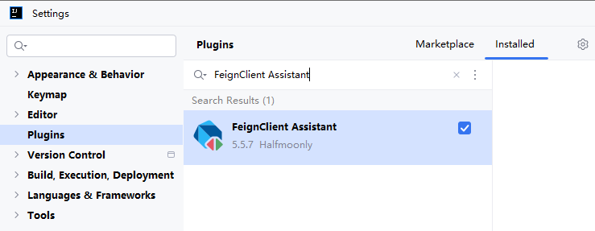
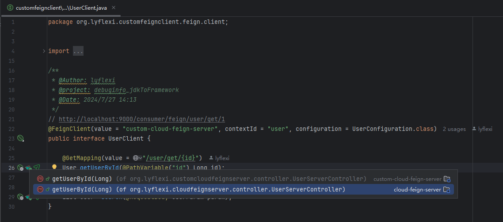
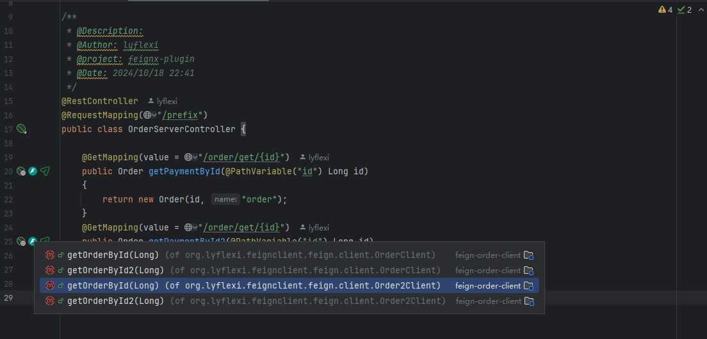
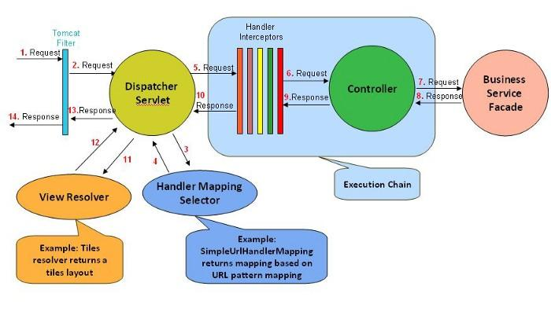
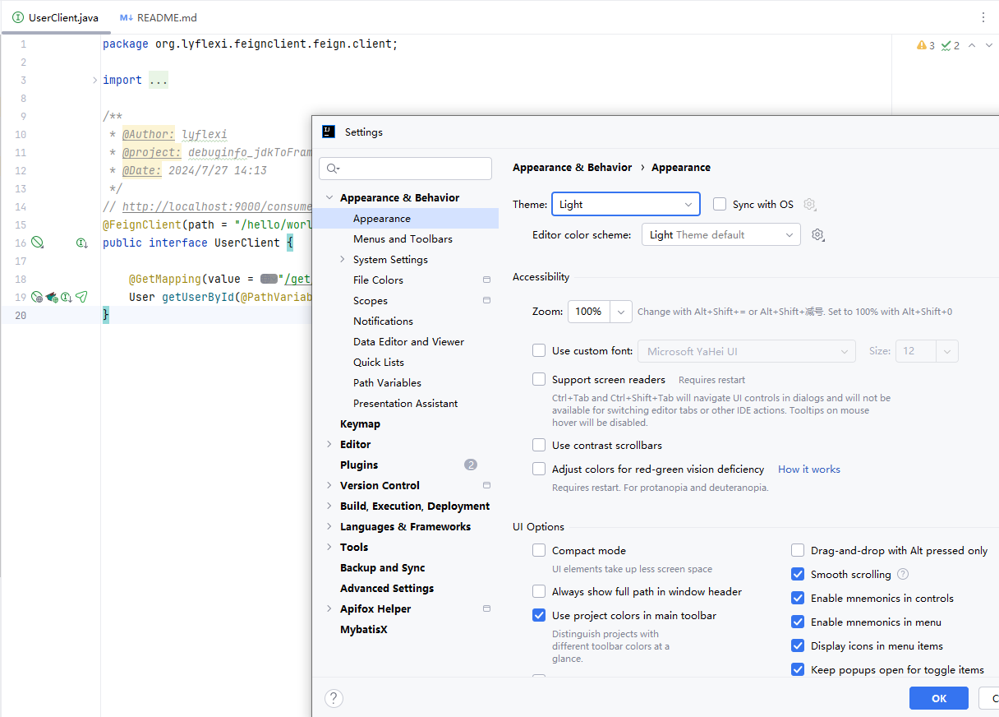

<div align="center">
  
  <h2>FeignX</h2>
</div>

## 贡献者

<a href="https://github.com/Halfmoonly/feignx-plugin/graphs/contributors">
  
</a>


##🚀🚀🚀 OpenFeign Assistant:v4.1.8
v4.1.8发布——对应分支main-fix-chchev2

        1. 我们更名啦，由FeignX更名为OpenFeign Assistant
        2. 极致提升性能，引入CacheManager，管理双边缓存FeignInterface和ApiController
        3. 欢迎Star：https://github.com/Halfmoonly/feignx-plugin

[feignx-4.1.8.zip](https://github.com/user-attachments/files/19140074/feignx-4.1.8.zip)


## 使用教程
已上架idea插件市场：https://plugins.jetbrains.com , 搜索OpenFeign Assistant下载安装，觉得好用，点个star⭐

---
<div align="center">
  
  <p>Marketplace</p>
</div>


OpenFeign Assistant is a Free SpringCloud Assistant

FeignX is inspired by IDEA's star plugin MybatisX.

You can flexibly jump back and forth between FeignClient and remote service ApiController cross-module,through method-level navigation gutter `bird`.

eg. feignClient -> ApiController
<div align="left">
  
</div>

eg. ApiController -> feignClient
<div align="left">
  
</div>

Most importantly, FeignX supports configuration file parsing，such as yml/yaml/properties of

1.server.servlet.context-path 

2.spring.mvc.servlet.path

FeignX is sufficiently accurate than other feign plugins on the market, after many rounds of optimization.

FeignX is sufficiently high-performance than other feign plugins on the market, after many rounds of optimization.

So, install the FeignX plugin as soon as possible!.
## 版本迭代
### Feignx:v1.0.0
cross-module：FeignClient-ApiController Mutually Navigation

cross-module：ApiController-FeignClient Mutually Navigation

### Feignx:v2.1.0
Adapted To Latest IDEA

### Feignx:v3.0.0

[fix]🐞 Major version fix , fix the bug that cannot dynamically detect new interfaces due to cache

### Feignx:v4.0.0
adapted properties/yml/yaml of 1.server.servlet.context-path and 2.spring.mvc.servlet.path


在 Spring Boot 出现之前，Dispatcher Servlet 是在 web.xml 文件中声明的，如下图
```xml
<web-app>
   <servlet>
         <servlet-name>example</servlet-name> 
        <servlet class> 
             org.springframework.web.servlet.DispatcherServlet 
        </servlet-class> 
        <load-on-startup>1</load -on-startup> 
    </servlet>
   <servlet-mapping>
        <servlet-name>test</servlet-name> 
        <url-pattern>*.test</url-pattern> 
   </servlet-mapping>
 </web-app>
```

这个DispatcherServlet是实际的Servlet，它继承自基类HttpServlet。

在 Spring Boot 出现之后，spring-boot-starter-web starter 自动装配机制将DispatcherServlet默认配置为 URL 模式“/”。

但是，如果需要，我们可以使用自定义 URL 模式。application.properties文件中如下
```properties
server.servlet.context-path=/hello
spring.mvc.servlet.path=/world
```

通过上面的配置，DispatcherServlet被配置为处理 URL 模式/world，并且springboot根上下文路径将是/hello。因此，DispatcherServlet监听http://ip/port/hello/world，，as prefix path by @FeignClient，the sample is below
```java
@FeignClient(path = "/hello/world",value = "cloud-feign-server", contextId = "user", configuration = UserConfiguration.class)
public interface UserClient {

    @GetMapping(value = "/user/get/{id}")
    User getUserById(@PathVariable("id") Long id);
}
```


yml/yaml配置同上。

### Feignx:v4.1.1
此版本feignx重绘了gutter


同时适配了最新版IDEA的Light主题，欢迎在IDEA内在线更新至4.1.1版本（三天后上线），或者提前安装离线版体验！
https://github.com/lyflexi/feignx-plugin/releases/tag/v4.1.1

修复了issues:https://github.com/Halfmoonly/feignx-plugin/issues/3



感谢官方工作人员的指引：Natalia Melnikova (JetBrains Marketplace) marketplace@jetbrains.com

感谢社区的帮助与提示：https://intellij-support.jetbrains.com/hc/en-us/community/posts/22814305825042-Why-don-t-pluginIcon-svg-appear-in-Light-theme?page=1#community_comment_22848980293394

感谢@yann Cebron：https://intellij-support.jetbrains.com/hc/en-us/profiles/1283051161-Yann-Cebron

开发社区：https://intellij-support.jetbrains.com/hc/en-us/community/topics/200366979-IntelliJ-IDEA-Open-API-and-Plugin-Development

### Feignx:v4.1.3
thanks my friend's pr : https://github.com/Halfmoonly/feignx-plugin/pull/9
1. Adapted bootstrap.properties/bootstrap.yml/bootstrap.yaml
2. Adapted many writtings of path，as @FeignClient(path = "/sys") and @FeignClient(path = "sys") and @FeignClient(path = "sys/")


### Feignx:v4.1.5
极少数分布式场景下的nacos需要以下配置，往往会配置在本地的bootstrap.yml/yaml中，而非application.yml/yaml中

1. server.servlet.context-path = /hello
2. spring.mvc.servlet.path = /world

此版本修复了FeignX读取本地bootstrap.yml/yaml中上述配置失效的问题

### Feignx:v4.1.6
FeignX 4.1.5 is binary incompatible with IntelliJ IDEA Ultimate IU-193.7288.26 due to the following problem Method not found . This can lead to NoSuchMethodError exception at runtime.

Feignx:v4.1.6 resolve IntelliJ IDEA Ultimate 2019.3.51 compatibility problem.

- remove 1 usage of deprecated API (V1.381)
- Invocation of unresolved method PsiEditorUtil.findEditor(PsiElement)
- Method SearchControllerAction.navigateToControllerCode(...) contains an invokestatic instruction referencing an unresolved method PsiEditorUtil.findEditor(PsiElement).

--- 


觉得好用，点个star⭐
