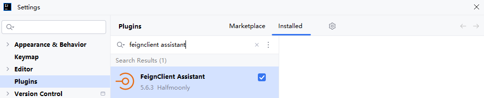
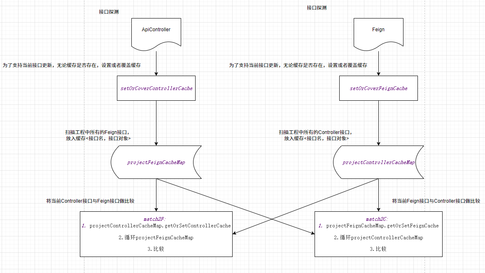

<div align="center">
  
  <h2>Navigator4URL OpenFeign RestController(FeignX)</h2>
</div>

## 贡献者名单

<a href="https://github.com/Halfmoonly/feignx-plugin/graphs/contributors">
  
</a>

## 我们更名啦，由FeignX更名为Navigator4URL OpenFeign RestController
已上架IntelliJ IDEA插件市场：https://plugins.jetbrains.com/plugin/25604-navigator4url-openfeign-restcontroller
- 2025/03/12 官方市场用户下载量突破5000
-

求star⭐⭐
## 使用教程
IntelliJ IDEA内Settings->plugins->Marketplace->搜索Navigator4URL OpenFeign RestController下载安装

---
<div align="center">
  
  <p>Marketplace</p>
</div>


<p>Navigator4URL OpenFeign RestController(FeignX) is a Free SpringCloud Assistant. Author 刘岩</p>

FeignX is inspired by IDEA's star plugin MybatisX.

1. You can flexibly jump back and forth between FeignClient and remote service ApiController cross-module,through method-level navigation gutter `bird`.

2. Navigator4URL OpenFeign RestController supports configuration file parsing，such as yml/yaml/properties of

   - server.servlet.context-path 

   - spring.mvc.servlet.path
   
3. Navigator4URL OpenFeign RestController is sufficiently accurate with options, after many rounds of optimization.

4. Navigator4URL OpenFeign RestController is sufficiently high-performance with Bilateral cache, after many rounds of optimization.

5. Navigator4URL OpenFeign RestController supports url full path copying to the clipboard (both Feign and Controller interfaces), In order to help the Vim friends.

eg. FeignClient -> ApiController

<div align="left">
  
</div>

eg. ApiController -> FeignClient

<div align="left">
  
</div>

So, install the FeignX plugin as soon as possible!.
## 更新日志
### 🚀Feignx:v1.0.0
cross-module：FeignClient-ApiController Mutually Navigation

cross-module：ApiController-FeignClient Mutually Navigation

### 🚀Feignx:v2.1.0
Adapted To Latest IDEA

### 🐞Feignx:v3.0.0

[fix] Major version fix , fix the bug that cannot dynamically detect new interfaces due to cache

### 🚀Feignx:v4.0.0
adapted properties/yml/yaml of 1.server.servlet.context-path and 2.spring.mvc.servlet.path


在 Spring Boot 出现之前，Dispatcher Servlet 是在 web.xml 文件中声明的，如下图
```xml
<web-app>
   <servlet>
         <servlet-name>example</servlet-name> 
        <servlet class> 
             org.springframework.web.servlet.DispatcherServlet 
        </servlet-class> 
        <load-on-startup>1</load -on-startup> 
    </servlet>
   <servlet-mapping>
        <servlet-name>test</servlet-name> 
        <url-pattern>*.test</url-pattern> 
   </servlet-mapping>
 </web-app>
```

这个DispatcherServlet是实际的Servlet，它继承自基类HttpServlet。

在 Spring Boot 出现之后，spring-boot-starter-web starter 自动装配机制将DispatcherServlet默认配置为 URL 模式“/”。

但是，如果需要，我们可以使用自定义 URL 模式。application.properties文件中如下
```properties
server.servlet.context-path=/hello
spring.mvc.servlet.path=/world
```

通过上面的配置，DispatcherServlet被配置为处理 URL 模式/world，并且springboot根上下文路径将是/hello。因此，DispatcherServlet监听http://ip/port/hello/world，，as prefix path by @FeignClient，the sample is below
```java
@FeignClient(path = "/hello/world",value = "cloud-feign-server", contextId = "user", configuration = UserConfiguration.class)
public interface UserClient {

    @GetMapping(value = "/user/get/{id}")
    User getUserById(@PathVariable("id") Long id);
}
```


yml/yaml配置同上。

### 🚀Feignx:v4.1.1
此版本feignx重绘了gutter


同时适配了最新版IDEA的Light主题，欢迎在IDEA内在线更新至4.1.1版本（三天后上线），或者提前安装离线版体验！
https://github.com/lyflexi/feignx-plugin/releases/tag/v4.1.1

修复了issues:https://github.com/Halfmoonly/feignx-plugin/issues/3


感谢官方工作人员的指引：Natalia Melnikova (JetBrains Marketplace) marketplace@jetbrains.com

感谢社区的帮助与提示：https://intellij-support.jetbrains.com/hc/en-us/community/posts/22814305825042-Why-don-t-pluginIcon-svg-appear-in-Light-theme?page=1#community_comment_22848980293394

感谢@yann Cebron：https://intellij-support.jetbrains.com/hc/en-us/profiles/1283051161-Yann-Cebron

开发社区：https://intellij-support.jetbrains.com/hc/en-us/community/topics/200366979-IntelliJ-IDEA-Open-API-and-Plugin-Development

### 🚀Feignx:v4.1.3
thanks my friend's pr : https://github.com/Halfmoonly/feignx-plugin/pull/9
1. Adapted bootstrap.properties/bootstrap.yml/bootstrap.yaml
2. Adapted many writtings of path，as @FeignClient(path = "/sys") and @FeignClient(path = "sys") and @FeignClient(path = "sys/")


### 🚀Feignx:v4.1.5
极少数分布式场景下的nacos需要以下配置，往往会配置在本地的bootstrap.yml/yaml中，而非application.yml/yaml中

1. server.servlet.context-path = /hello
2. spring.mvc.servlet.path = /world

此版本修复了FeignX读取本地bootstrap.yml/yaml中上述配置失效的问题

### 🐞Feignx:v4.1.6
FeignX 4.1.5 is binary incompatible with IntelliJ IDEA Ultimate IU-193.7288.26 due to the following problem Method not found . This can lead to NoSuchMethodError exception at runtime.

Feignx:v4.1.6 resolve IntelliJ IDEA Ultimate 2019.3.51 compatibility problem.

- remove 1 usage of deprecated API (V1.381)
- Invocation of unresolved method PsiEditorUtil.findEditor(PsiElement)
- Method SearchControllerAction.navigateToControllerCode(...) contains an invokestatic instruction referencing an unresolved method PsiEditorUtil.findEditor(PsiElement).

--- 
### 🚀 OpenFeign Assistant:v4.1.8
v4.1.8发布——对应分支main-fix-cachev2

reslove issue #10：https://github.com/Halfmoonly/feignx-plugin/issues/10

        1. 我们更名啦，由FeignX更名为OpenFeign Assistant
        2. 极致提升性能，引入CacheManager，管理双边缓存FeignInterface和ApiController
        3. 欢迎Star：https://github.com/Halfmoonly/feignx-plugin

[feignx-4.1.8.zip](https://github.com/user-attachments/files/19140074/feignx-4.1.8.zip)


### 🐞 OpenFeign Assistant:v4.1.9
v4.1.9发布——对应分支main-fix-cachev3

我们优化了双边缓存更新策略（Optimize cache update policies）

https://github.com/user-attachments/files/19148594/OpenFeign.Assistant-4.1.9.zip


### 🚀 V5.1.0 更新内容
reslove issue #6：https://github.com/Halfmoonly/feignx-plugin/issues/6


1. 我们又更名啦[笑哭]，由FeignX更名为Navigator4URL OpenFeign RestController
2. 为了方便Vim党，我们支持了url完整路径复制至剪切板（Feign接口和Controller接口均支持）
3. 欢迎Star：https://github.com/Halfmoonly/feignx-plugin

CopyFeignUrlLineMarkerProvider：


CopyControllerUrlLineMarkerProvider：


朋友们记得先将zip解压出jar包，再离线安装jar包哟~~：https://github.com/user-attachments/files/19149196/Navigator4URL.OpenFeign.RestController-5.1.0.zip

### 🐞 V5.1.1 更新内容
修复分支：hotfix/main-copy-notify

1. 我们修复了一键复制URL功能的消息通知失败的问题，以及偶先空指针的现象

2. 我们优化了Copy-Gutter和Bird-Gutter的展现位置，将其从方法签名处移至RequestMapping等Rest注解处，这样更加符合直觉

3. 我们优化了Copy-Gutter和Bird-Gutter的动态解析，使用户后期在修改方法签名的时候（如添加/**/注释或者添加自定义业务注解的时候），Gutter的位置随着RequestMapping等Rest注解的位置动态生效

4. 我们优化了一键复制URL功能的Copy-Gutter图标设计，更加的优雅


### 🐞 V5.1.2 更新内容

1. 我们修复了https://github.com/Halfmoonly/feignx-plugin/issues/11，这曾经是个已经被修复但忘记合并至主分支的修复分支：hotfix/main-fix-bootstrap，见：https://github.com/Halfmoonly/feignx-plugin/issues/8


### 🐞 V5.2.0 更新内容
本次对应修复/缓存优化/多线程优化/API优化的分支：main-fix-cachev4

1. 我们优化了双边缓存的更新机制，同时重构了缓存框架，大大提升了插件性能
2. 我们优化了用户打注释/***/的时候，由于psiMethod丢失，可能导致的空指针异常
3. 我们使用了IntelliJ的类快速索引缓存系统PsiShortNamesCache，狠狠加速了原来的手写磁盘递归扫描Class（allJavaFileClass）
4. 我们使用了Java线程池，加速了初始化过程中，构建出全量接口方法对象HttpMappingInfos的速度（ApiControllers和FeignClients）
5. 我们使用了IntelliJ的带缓存的注解判断方法psiMethod.hasAnnotation，加速了类型判断（ApiController和FeignClient）

重构的双边缓存架构：



有匪君子，如切如磋错，如琢如磨--2025/03/15 凌晨两点

### 🚀 V5.2.1 更新内容
对应分支：feat/main-parallel

默认IOU密集型程序核心线程数为`2*N`，并自定义了线程池，优化初始化过程中，构建出全量接口方法对象HttpMappingInfos的速度（ApiControllers和FeignClients）

### 🚀 V5.3.0 更新内容
对应分支：feat/main-cache

我们额外自定义了项目初始化PsiClass缓存管理器InitialPsiClassCacheManager，将原先的两次全盘allJavaFileClass扫描降低为1次，狠狠加速了原来手写的磁盘递归扫描

### TODO兼容性遗留
老版本的IDEA如2022注意冲突(正常使用请忽略此条)

请按照以下路径关闭git默认的内联作者提示

Settings

Editor

Inlay Hints

Code Vision

关闭Code author

---

觉得好用，点个star⭐

最新版本，请即时关注IntelliJ IDEA插件市场更新Navigator4URL OpenFeign RestController

https://plugins.jetbrains.com/plugin/25604-navigator4url-openfeign-restcontroller

IDEA内插件市场一键安装最方便哟~~
