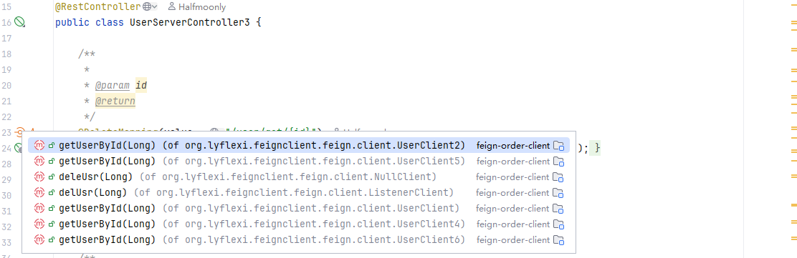

  
  
  <h2>FeignClient Assistant</h2>

## 贡献者名单
Respect!

我们欢迎各位的宝贵意见(^^ゞ)

**诚邀广大开发者大佬们的Pull Request，让我们一起完善FeignClient Assistant(FeignX)插件**

最新版本插件请及时关注IntelliJ IDEA插件市场更新FeignClient Assistant

感谢朋友们的star⭐⭐

## 里程碑🎴

我们更名啦：FeignClient Assistant

曾用名：[FeignX]/[Navigator4URL OpenFeign RestController]

已上架IntelliJ IDEA插件市场：https://plugins.jetbrains.com/plugin/25604-feignclient-assistant
- 2025/03/12 官方市场用户下载量突破5000
- 2025/03/20 官方市场用户下载量突破6000
- 2025/03/26 官方市场用户下载量突破7000
- 2025/04/17 官方市场用户下载量突破1W！新的里程碑
- 

## 使用教程
IntelliJ IDEA内Settings->plugins->Marketplace->搜索FeignClient Assistant下载安装

---

  
  
Marketplace

中文说明：

FeignClient Assistant是一个免费的SpringCloud FeignClient与远程SpringBoot ApiController之间的代码导航助手。

曾用名：[FeignX]/[Navigator4URL OpenFeign RestController]

1. 受MybatisX和方法级导航槽‘ Bird ’的启发，您可以灵活并且跨模块的在FeignClient客户端和远程服务ApiController之间来回跳转。
2. FeignClient Assistant支持yml/yaml/属性解析，如'server.servlet.context-path'和'spring.mvc.servlet.path’
3. FeignClient Assistant精确定位目标接口，在多目标接口场景下，FeignClient Assistant给用户提供多选项
4. FeignClient Assistant基于双边缓存与PSI缓存优化，具有足够好的性能
5. FeignClient Assistant支持实时动态解析目标接口，无需手动刷新缓存
6. FeignClient Assistant支持url全路径复制到剪贴板（包括Feign和Controller接口），以帮助Vim朋友。

附图演示：

eg. FeignClent接口方法 跨模块导航跳转至 目标ApiController接口，与URL全路径一键剪切板拷贝

  

eg. ApiController接口方法 跨模块导航跳转至 目标FeignClient接口，与URL全路径一键剪切板拷贝

  

## 更新日志

更新日志：[updateLog.md](feignx/docs/updateLog.md)